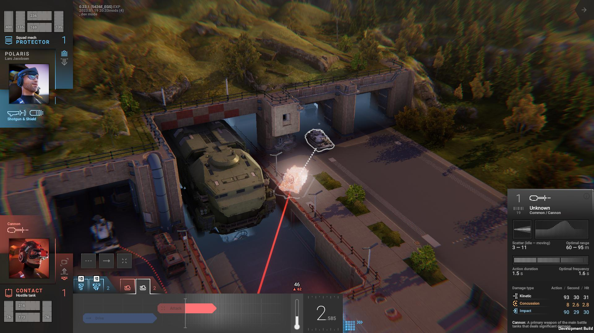

# TimelinePopups

**This mod is obsolete.** The game has been patched by the publisher so now it shows the weapon info popup. If you want the popup for the targeted unit, see my [TargetedUnitPopup mod](https://github.com/echkode/PhantomBrigadeMod_TargetedUnitPopup). If you want the range circle overlay when dragging an attack action, see my [mod for that](https://github.com/echkode/PhantomBrigadeMod_WeaponRangeCircleOverlay).

A library mod for [Phantom Brigade (Alpha)](https://braceyourselfgames.com/phantom-brigade/) that brings back the targeted unit and equipment info popups that used to be displayed when you hovered over an attack action in the timeline.

It is compatible with game patch **0.23.1-b5426**. That is an **EXPERIMENTAL** release. All library mods are fragile and susceptible to breakage whenever a new version is released.

The targeted unit popup appears in the upper left corner and the equipment info popup appears in the lower right corner. The equipment info popup has the same info as when you hover over an attack action button above the timeline.

## Settings

There are some settings that can be changed to tweak how the mod works. The `settings.yaml` file should be stored in the same folder as the mod's `metadata.yaml` file.

| Setting Name | Value Type | Description |
| ------------ | ---------- | ----------- |
| enableLogging | bool | set to `true` to turn on diagnostic logging |
| showPopupsForShields | bool | set to `true` to enable popups when hovering over a shield action |
| hoverDisplayElements | enum | controls which popups are displayed on hover; see below |
| dragDisplayElements | enum | controls which popups are displayed on drag; see below |
| enableTargetPopupInSimulation | bool | **experimental** show the targeted unit popup in the simulation phase |

The `hoverDisplayElements` and `dragDisplayElements` settings are a set of enumerated values to control which popups are displayed the corresponding event.

| Name | Description |
| ---- | ----------- |
| None | nothing is displayed |
| TargetPopup | show the targeted unit popup |
| EquipmentInfoPopup | show the equipment info popup |
| Range | show the range circle in the world |

An example `settings.yaml` file is included in the repo with all settings on but the mod is meant to be used without a settings file.

## Bonus Feature

In addition to showing the targeted unit and equipment info popups on hover, I've added an extra capability of showing the range circle when dragging an attack action in the timeline. I've often found that the reason I'm dragging an attack is to time it so that the target unit reaches the optimal range at the right time. That's hard to get right without being able to see the range circle.

## Bonus Fixes

In addition to bringing back the popups, this mod also fixes a couple of bugs with the equipment info popup when you hover over an attack action button above the timeline that appeared in patch 0.23.1-b5426.

One bug is that the popup doesn't disappear when you move the mouse so that it's no longer hovering over the button. You have to hover over and then leave a non-attack button for the popup to disappear.

The other bug is that sometimes the equipment info popup doesn't show at all when you hover over an attack action button above the timeline. The problem happens only if you had hovered over an item in the inventory view and then went into combat. It can be prevented by making sure you hover over an item in the unit loadout view just before entering combat if you have done anything in the inventory view.
